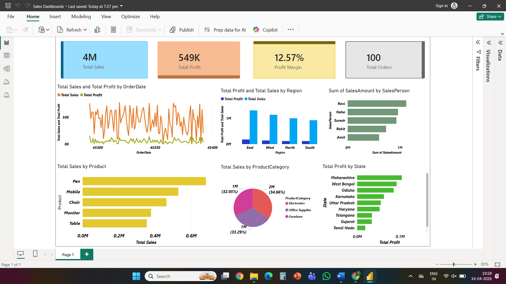

# Sales Data Analysis Dashboard (Power BI)

## 📊 Project Overview
This project presents an interactive Power BI dashboard for analyzing sales performance. It helps in understanding key business metrics and trends.

## 🚀 Features
- KPI metrics: Total Sales, Total Profit, Total Orders
- Sales analysis by region, product, and category
- Time-based sales trends
- Interactive dashboard with visual insights

## 🛠 Tools Used
- Power BI
- Microsoft Excel

## 📷 Dashboard Preview
 

## 📈 Insights
- Identified top-performing regions and products
- Analyzed profit trends over time
- Derived business insights for decision-making
